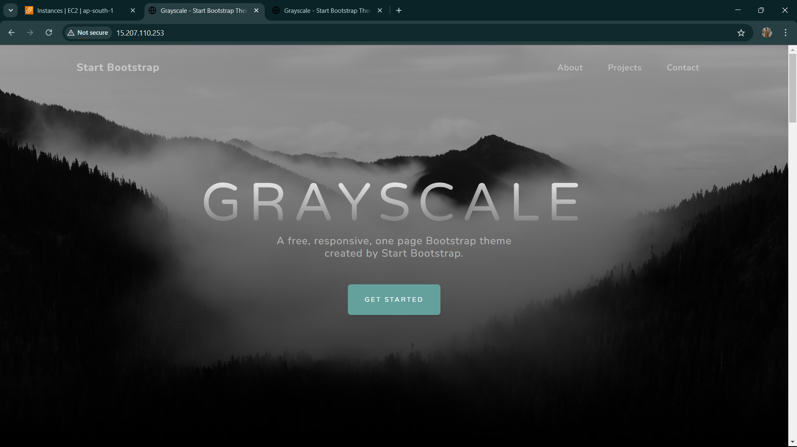

# Multi-Server AutoDeploy with Ansible

## 📌 Project Overview
This project demonstrates the deployment of a website on multiple EC2 instances using **Ansible Playbooks**. It automates the installation and configuration of an Apache web server, fetches website files from GitHub, and ensures smooth hosting with minimal manual intervention.

## 🎯 Objective
To automate the deployment of a **scalable and redundant web architecture** ensuring:
- **Effortless Apache Web Server installation** across multiple instances.
- **Seamless website deployment** using Ansible automation.
- **Efficient configuration management** for remote servers.

## 🏗️ Project Scope
This architecture comprises multiple EC2 instances playing specific roles:
- **Instance 1 (Control Node)** - Hosts Ansible for automated configurations.
- **Instance 2 (Web Server 1)** - Runs Apache and hosts the website.
- **Instance 3 (Web Server 2)** - Runs Apache and hosts the website for redundancy.

## ⚙️ Functional Components
### ✅ **Ansible Configuration**
- Defined inventory (`hosts`) for remote server management.
- Configured `ansible.cfg` for seamless automation.

### ✅ **Web Server Deployment**
- Installed **Apache HTTP Server** using Ansible.
- Configured **automatic service startup**.
- Deployed website files from **GitHub repository**.
- Ensured proper file structure and permissions.

### ✅ **Automation with Ansible Playbooks**
- Playbooks automate:
  - **Apache installation**
  - **File retrieval & extraction**
  - **Server restart**
- Includes **handlers** for service management.

## 🚀 Key Implementations
✔ **Automated Apache Web Server setup** across multiple EC2 instances.

✔ **Ansible role-based structure** for efficient and modular playbook management.

✔ **EC2 Security Group Configuration** allowing HTTP & HTTPS traffic.

✔ **Automated website deployment** directly from GitHub.

✔ **Scalability & Redundancy** through multiple web servers.

## 📂 Folder Structure
```
ansible/
├── ansible.cfg
├── hosts
├── roles.yml
├── roles/
│   ├── webserver/
│   │   ├── tasks/
│   │   │   ├── main.yml
│   │   ├── handlers/
│   │   │   ├── main.yml
│   │   ├── defaults/
│   │   │   ├── main.yml
│   │   ├── vars/
│   │   │   ├── main.yml
│   │   ├── templates/
│   │   │   ├── main.yml
│   │   ├── files/
│   │   ├── meta/
│   │   │   ├── main.yml
```

## 🔧 Step-by-Step Setup
### **1. Verify Connectivity**
Ensure that Ansible can communicate with the EC2 instances:
```bash
ansible all -m ping
```

### **2. Configure Ansible Control Node**
Update `ansible.cfg` with required settings:
```
[defaults]
inventory= /root/ansible/hosts
remote_user= ec2-user
ask_pass= false
private_key_file= /root/ansible/Key3.pem
```

### **3. Define Inventory (`hosts`)**
```
[webservers]
server1.com
server2.com
```

### **4. Create Web Server Role**
```bash
ansible-galaxy init webserver
```

### **5. Configure `roles/webserver/tasks/main.yml`**
```yaml
---
- name: Install Apache HTTP server
  ansible.builtin.yum:
    name: httpd
    state: present

- name: Start and enable Apache service
  ansible.builtin.service:
    name: httpd
    state: started
    enabled: yes

- name: Download website files from GitHub
  ansible.builtin.get_url:
    url: https://github.com/mudasirhaji/website/raw/main/website.zip
    dest: /tmp/website.zip

- name: Unzip the website files
  ansible.builtin.unarchive:
    src: /tmp/website.zip
    dest: /var/www/html/
    remote_src: yes
    extra_opts: ["-o"]

- name: Move files to correct location
  ansible.builtin.shell: mv /var/www/html/website/* /var/www/html/ || true

- name: Cleanup extracted directory
  ansible.builtin.file:
    path: /var/www/html/website
    state: absent

- name: Cleanup zip file
  ansible.builtin.file:
    path: /tmp/website.zip
    state: absent

- name: Restart Apache to apply changes
  ansible.builtin.service:
    name: httpd
    state: restarted
```

### **6. Configure `roles/webserver/handlers/main.yml`**
```yaml
---
- name: Restart Apache
  ansible.builtin.service:
    name: httpd
    state: restarted
```

### **7. Create and Execute Playbook (`roles.yml`)**
```yaml
---
- name: Configure Web Server
  hosts: webservers
  become: yes
  roles:
    - webserver
```

### **8. Run Playbook**
```bash
ansible-playbook roles.yml
```

## 🎯 Expected Outcomes
✅ **Automated, scalable deployment** of Apache web servers.

✅ **Redundant and fault-tolerant web hosting** with multiple servers.

✅ **Efficient DevOps pipeline** with Ansible automation.

✅ **Hands-on experience** with cloud-based infrastructure management.

## 🔗 Technologies Used
- **Cloud Provider**: AWS (EC2 Instances, Security Groups)
- **Configuration Management**: Ansible
- **Operating System**: Linux (CentOS/Ubuntu)
- **Web Server**: Apache HTTP Server
- **Version Control**: GitHub
- **Security**: SSH, Firewall, Access Control

## 🎓 Learning & Takeaways
This project provided valuable insights into **Infrastructure as Code (IaC), Cloud Computing, and Configuration Management** using Ansible. The ability to **automate deployment and scale applications** efficiently was a key takeaway! 🚀

---

### 🌐 **Deployed Website** 📸:
- **Server 1:** [http://15.207.110.253/](http://15.207.110.253/)
- **Server 2:** [http://3.108.215.38/](http://3.108.215.38/)



## 📌 **Connect with Me**
- Stay updated on [LinkedIn](https://www.linkedin.com/in/-kartikjain/) for more DevOps projects and insights.
- Follow along as I explore **Cloud Infrastructure, Ansible Automation, and DevOps practices**.
- Let's collaborate and build scalable solutions together!

